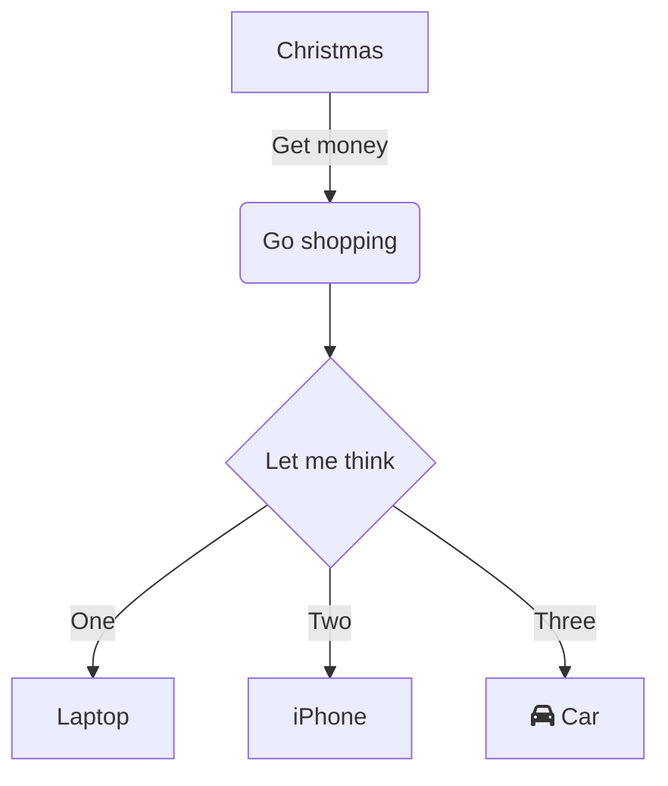
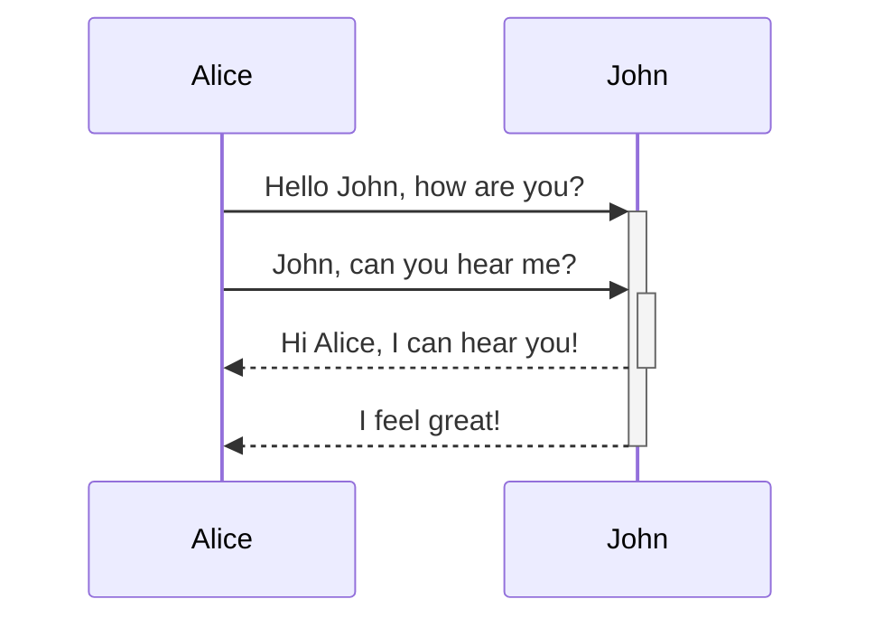
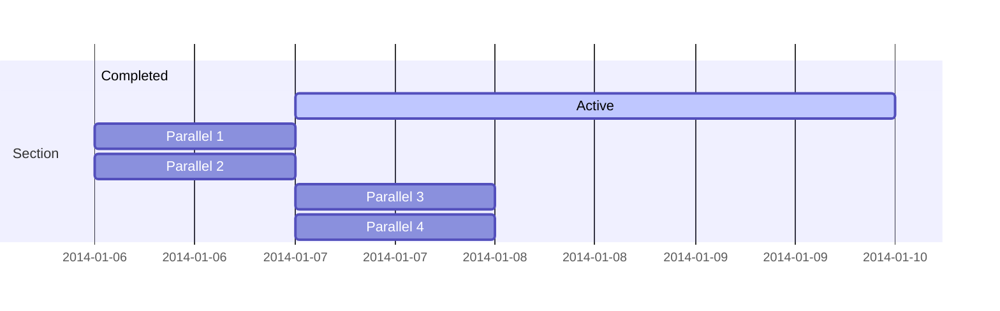
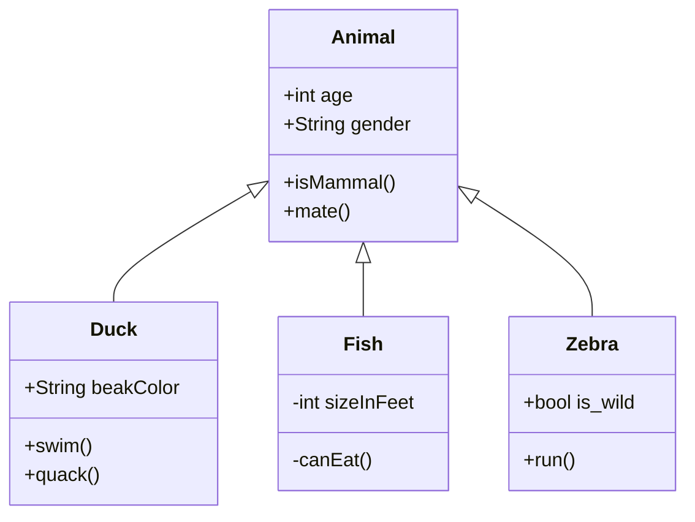
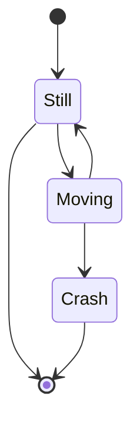
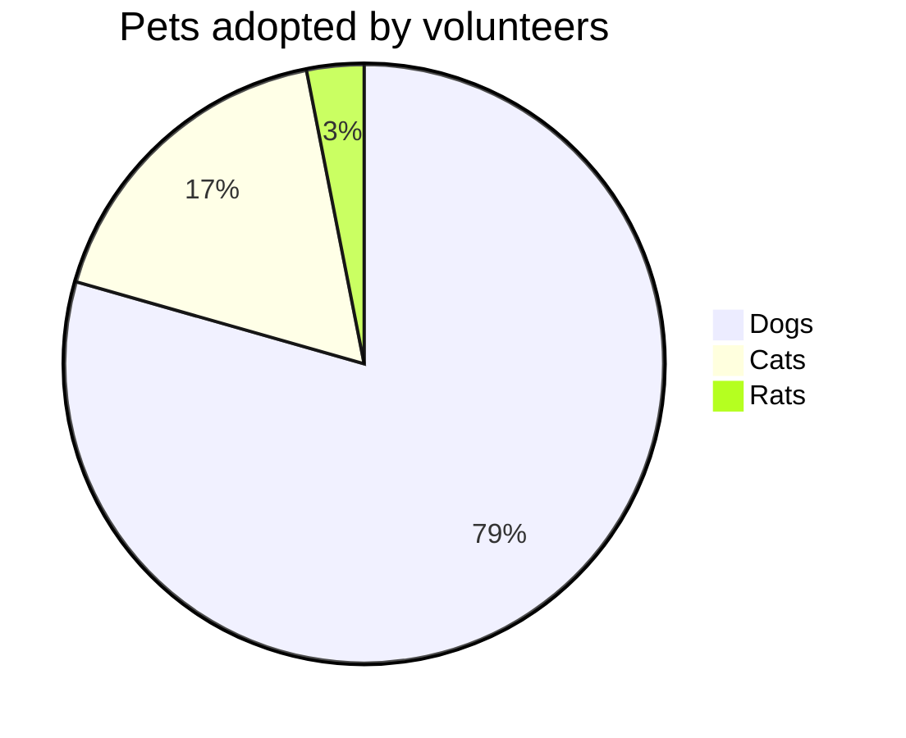
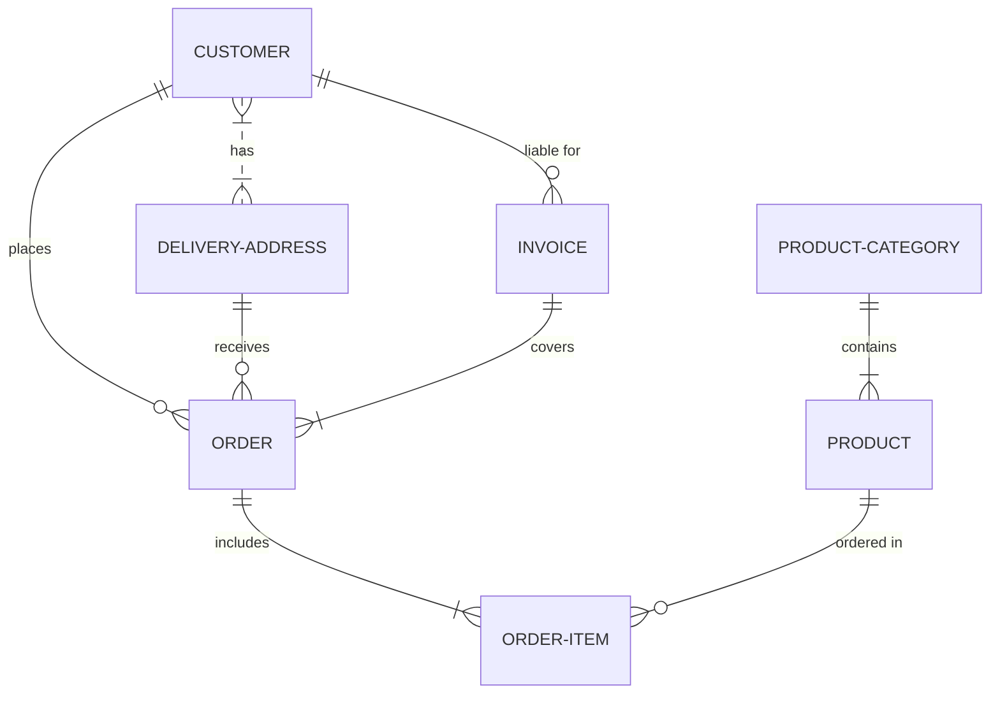
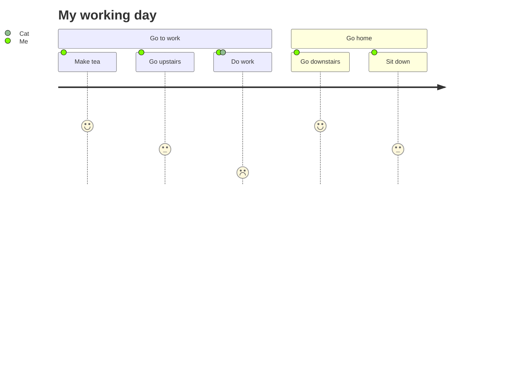

# Test

Flow Chart

```mermaid
graph TD
    A[Christmas] -->|Get money| B(Go shopping)
    B --> C{Let me think}
    C -->|One| D[Laptop]
    C -->|Two| E[iPhone]
    C -->|Three| F[fa:fa-car Car]
```

Sequence Diagram

```mermaid
sequenceDiagram
    Alice->>+John: Hello John, how are you?
    Alice->>+John: John, can you hear me?
    John-->>-Alice: Hi Alice, I can hear you!
    John-->>-Alice: I feel great!
```

Gantt Diagram

```mermaid
gantt
  section Section
  Completed :done,    des1, 2014-01-06,2014-01-08
  Active        :active,  des2, 2014-01-07, 3d
  Parallel 1   :         des3, after des1, 1d
  Parallel 2   :         des4, after des1, 1d
  Parallel 3   :         des5, after des3, 1d
  Parallel 4   :         des6, after des4, 1d
```

Class Diagram

```mermaid
classDiagram
    Animal <|-- Duck
    Animal <|-- Fish
    Animal <|-- Zebra
    Animal : +int age
    Animal : +String gender
    Animal: +isMammal()
    Animal: +mate()
    class Duck{
      +String beakColor
      +swim()
      +quack()
    }
    class Fish{
      -int sizeInFeet
      -canEat()
    }
    class Zebra{
      +bool is_wild
      +run()
    }
```

State Diagram

```mermaid
stateDiagram
    [*] --> Still
    Still --> [*]
    Still --> Moving
    Moving --> Still
    Moving --> Crash
    Crash --> [*]
```

Pie Chart

```mermaid
pie title Pets adopted by volunteers
    "Dogs" : 386
    "Cats" : 85
    "Rats" : 15
```

ER Diagram

```mermaid
erDiagram
    CUSTOMER }|..|{ DELIVERY-ADDRESS : has
    CUSTOMER ||--o{ ORDER : places
    CUSTOMER ||--o{ INVOICE : "liable for"
    DELIVERY-ADDRESS ||--o{ ORDER : receives
    INVOICE ||--|{ ORDER : covers
    ORDER ||--|{ ORDER-ITEM : includes
    PRODUCT-CATEGORY ||--|{ PRODUCT : contains
    PRODUCT ||--o{ ORDER-ITEM : "ordered in"
```

User Journey

```mermaid
journey
  title My working day
  section Go to work
    Make tea: 5: Me
    Go upstairs: 3: Me
    Do work: 1: Me, Cat
  section Go home
    Go downstairs: 5: Me
    Sit down: 3: Me
```
